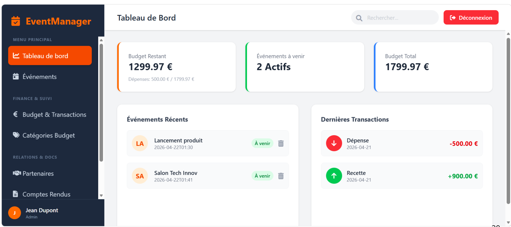
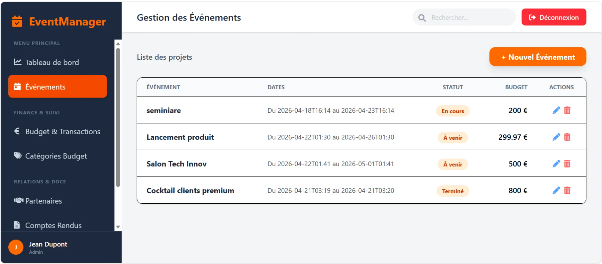
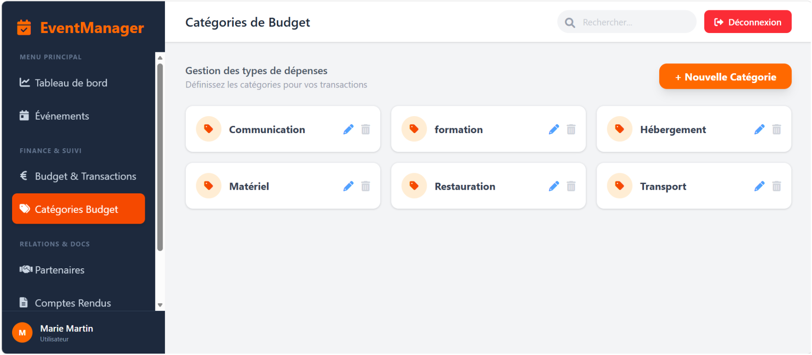
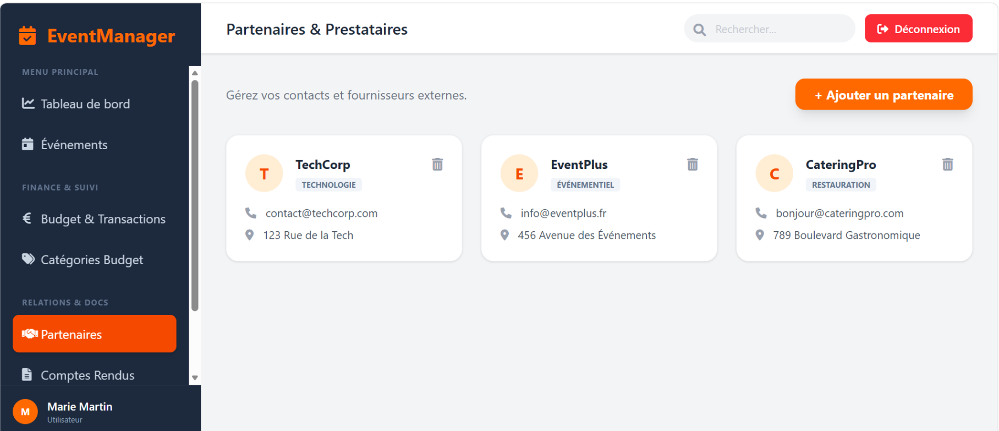

# Gestion des événements internes – Sopra Steria

1) Présentation

Application web complète permettant de gérer les événements internes de l' entreprise **Sopra Steria**: utilisateurs, partenaires, budgets, transactions et comptes rendus.

Ce projet a été réalisé dans le cadre de mon Master 1 informatique.

🎯 Objectifs
Centraliser la gestion des événements
Suivre les budgets et dépenses
Faciliter la prise de décision via des rapports structurés

2) Stack technique

**Backend**

Java + Spring Boot
API REST
JPA / Hibernate

**Frontend**

React + TypeScript
Vite
Tailwind CSS

**Base de données**

SQL (script fourni **bd.sql**)

3) Fonctionnalités principales

Gestion des événements
Gestion des utilisateurs et partenaires
Suivi des transactions et catégories de budget
Création de comptes rendus
Tableau de bord interactif

4) Aperçu

5) Comment Lancer le projet

ouvrir le dossier PROJET_ANNUEL_M1 sur votre navigateur, 
ensuite ouvrez votre terminal et séparer le en deux et faite sur l'un :

cd Backend
./mvnw spring-boot:run (pour lancer la Backend)

et sur l'autre : 

cd Frontend
npm install
npm run dev (pour lancer le Frontend)

Ce que j’ai réalisé : 

Conception de l’architecture backend (Spring Boot)
Création des API REST
Développement de l’interface utilisateur en React
Mise en place de la communication frontend/backend
Structuration de la base de données

6) Améliorations prévues : 

gestion des rôles
Tests automatisés
Export PDF
Tableau de bord analytique avancé

8) Points forts

Architecture full-stack moderne
Séparation claire frontend / backend
Utilisation de technologies demandées en entreprise (React, API REST, JAVA, Java Script)